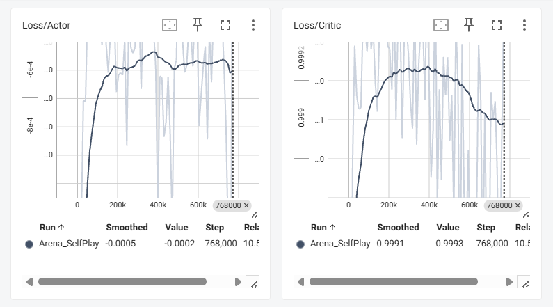

# Experiment 03 — Reward Refinement & Observation Enhancement

**Date:** 2026-07-08

---

## Goal

Improve policy quality through reward refinement and richer environmental observations while maintaining stable PPO optimization.

Although Experiment 02 successfully established distinct combat identities through asymmetric reward shaping, telemetry analysis revealed several remaining issues.

- Warrior excessively spammed Basic Attack despite a low hit rate.
- Mage rarely utilized defensive crowd-control skills.
- Agents had limited awareness of incoming hazards.
- Reward magnitude encouraged action frequency more than action quality.

Rather than introducing additional balance changes, this experiment focuses on refining reward signals and observation features to produce more efficient combat behavior.

---

# Motivation

Experiment 02 demonstrated that reward engineering has a greater influence on policy learning than simple stat balancing.

However, several undesirable optimization behaviors emerged.

- Warrior repeatedly executed Basic Attack regardless of hit probability.
- Mage avoided close-range situations instead of learning defensive responses.
- Hazard awareness was limited to object position only.
- The observation space still contained unused padding dimensions.

To address these issues, both the reward function and observation representation were redesigned while preserving the PPO architecture.

---

# Reward Refinement

## Action Cost

A small action cost is assigned whenever an agent attempts to execute a skill.

| Condition | Reward |
|-----------|--------:|
| Skill Execution | -0.005 |
| Skill Attempt During Cooldown | -0.005 |

Instead of encouraging continuous skill usage, the policy is encouraged to maximize reward efficiency per action.

---

## Aim Alignment Reward

A small positive reward is granted when the agent accurately faces the opponent before executing a skill.

Alignment is evaluated using the normalized dot product

```
dot(forward, direction_to_enemy)
```

When

```
dot ≥ 0.9
```

the agent receives

| Condition | Reward |
|-----------|--------:|
| Accurate Aim | +0.002 |

This reward promotes deliberate skill execution rather than random attack attempts.

---

## Warrior Reward

The asymmetric rewards introduced in Experiment 02 remain active.

| Condition | Reward |
|-----------|--------:|
| Distance ≤ 2.5 | +0.0005 / step |
| Distance ≥ 5.0 | -0.0002 / step |
| Combo Hit (within 1.5 sec) | +0.2 |

These rewards continue encouraging sustained melee pressure.

---

## Mage Curriculum Reward

Telemetry from Experiment 02 indicated that Nova Stun was rarely used successfully.

Instead of globally increasing its reward, a curriculum-style reward was introduced.

When

```
Distance ≤ 2.0
```

and the Mage successfully lands Nova Stun,

an additional reward is granted.

| Condition | Reward |
|-----------|--------:|
| Nova Stun Hit (Emergency Situation) | +0.5 |

This teaches defensive behavior specifically during dangerous close-range situations while preserving normal ranged combat.

---

# Observation Enhancement

The observation dimension remains **30**, but previously unused padding dimensions are replaced with meaningful environmental information.

---

## Hazard Telegraph Detection

Charging skills now expose their future danger area before execution.

Examples include

- Meteor impact position
- Warrior Charge destination
- Chain Pull origin

This allows agents to react before damage occurs rather than after collision.

---

## Hazard Velocity Observation

The Hazard Radar is extended to observe both

- Hazard Position
- Hazard Velocity

instead of position alone.

```
Hazard Radar (7)

• Relative Position (2)

• Normalized Velocity (2)

• Reserved Padding (3)
```

Providing velocity information enables the policy to estimate projectile trajectories instead of reacting only after hazards become nearby.

---

## Hazard Avoidance Reward

Agents receive a small continuous penalty while remaining inside dangerous regions.

The closer the agent is to the center of the hazard,

the larger the penalty becomes.

This encourages proactive evasive movement without requiring scripted avoidance behavior.

---

# PPO Optimization

The PPO architecture remains unchanged.

The optimization settings introduced in Experiment 02 were retained.

| Parameter | Value |
|-----------|------:|
| Batch Size | 2048 |
| Gradient Clipping | max_norm = 0.5 |

Since reward refinement increases reward complexity,

larger batches reduce gradient variance,

while gradient clipping prevents unstable policy updates.

No further optimizer modifications were required.

---

# TensorBoard Analysis



## Actor Loss

The Actor Loss continuously oscillates around zero throughout training.

No sudden divergence or policy collapse was observed.

This indicates that the policy successfully maintains exploration while gradually improving decision quality.

The stable oscillation further validates the effectiveness of

- larger batch size
- gradient clipping

introduced in the previous experiment.

---

## Critic Loss

The Critic Loss initially increases before gradually decreasing.

This behavior closely follows the expected convergence pattern of PPO.

The refined reward function introduces additional reward components,

causing larger prediction errors during early training.

As training progresses,

the value network gradually learns the new reward distribution and converges toward a stable estimate.

---

# Training Result

## Warrior

### Overall Statistics

| Metric | Value |
|--------|------:|
| Win Rate | **36%** |
| Total Damage | 132.20 |
| Damage Taken | 134.69 |
| DPS | 5.46 |
| Survival Time | 24.20 sec |
| Average Distance | 5.03 |

### Skill Telemetry

| Skill | Cast Count | Hit Rate | Avg Skill Damage |
|------|-----------:|----------:|-----------------:|
| Basic Attack | 34.13 | 8% | 54.95 |
| Dash | 11.32 | 17% | 18.31 |
| Charge Attack | 6.67 | 12% | 22.48 |
| Chain Pull | 4.07 | **33%** | **79.30** |

#### Additional Metrics

| Metric | Value |
|--------|------:|
| Charge Success Rate | 92% |
| CC Success Rate | 12% |
| Chain Pull Success Rate | 79% |

---

## Mage

### Overall Statistics

| Metric | Value |
|--------|------:|
| Win Rate | **22%** |
| Total Damage | 104.95 |
| Damage Taken | 103.01 |
| DPS | 5.56 |
| Survival Time | 18.86 sec |
| Average Distance | 4.89 |

### Skill Telemetry

| Skill | Cast Count | Hit Rate | Avg Skill Damage |
|------|-----------:|----------:|-----------------:|
| Basic Attack | 22.68 | 42% | 47.41 |
| Teleport | 6.80 | - | - |
| Charge Attack (Nova Stun) | 6.68 | **11%** | 19.31 |
| Meteor | 2.27 | **53%** | **106.87** |

#### Additional Metrics

| Metric | Value |
|--------|------:|
| Charge Success Rate | 94% |
| Meteor Success Rate | 64% |

---

# Analysis

## 1. Warrior Dominates the Current Meta

Compared with Experiment 02,

| Experiment | Warrior | Mage |
|------------|---------:|------:|
| Experiment 02 | 32% | 27% |
| Experiment 03 | **36%** | **22%** |

The Warrior now consistently controls combat tempo.

Its longer survival time and higher damage output indicate that aggressive melee behavior has become firmly established.

---

## 2. Reduced Skill Spamming

The action-cost penalty successfully reduced unnecessary skill execution.

Compared with the previous experiment,

Basic Attack usage decreased

```
36.01 → 34.13
```

while

Average Damage increased

```
49.69 → 54.95
```

This suggests that the policy became more selective and efficient instead of relying solely on repeated attack attempts.

---

## 3. Curriculum Learning Improved Defensive Behavior

The Mage's emergency defense strategy began to emerge.

CC Charge Skill's Hit Rate

```
8% → 11%
```

Although the improvement remains modest,

the curriculum reward successfully encouraged defensive behavior during close-range encounters.

---

## 4. Improved Skill Efficiency

Several skills demonstrate measurable improvement.

### Warrior

| Skill | Experiment 02 | Experiment 03 |
|--------|--------------:|--------------:|
| Basic Attack Hit Rate | 7% | **8%** |
| Dash Hit Rate | 15% | **17%** |
| Charge Hit Rate | 10% | **12%** |
| Chain Pull Hit Rate | 30% | **33%** |

---

### Mage

| Skill | Experiment 02 | Experiment 03 |
|--------|--------------:|--------------:|
| Nova Stun Hit Rate | 8% | **11%** |
| Meteor Hit Rate | 50% | **53%** |

Reward refinement consistently improved overall skill precision.

---

## 5. Improved Environmental Awareness

The enhanced Hazard Radar now provides

- hazard position
- movement direction
- charging telegraph

instead of simple positional information.

This enables agents to anticipate incoming attacks and react before hazards become immediately dangerous.

Although hazard avoidance statistics are not yet explicitly measured,

qualitative gameplay demonstrates noticeably smoother movement around projectiles and telegraphed abilities.

---

# Conclusion

Experiment 03 demonstrates that refining reward functions and improving observation quality are more effective than further increasing reward magnitude or modifying gameplay parameters.

The introduction of action costs reduced inefficient skill spamming, aim-alignment rewards encouraged more deliberate attacks, and curriculum learning successfully improved the Mage's defensive behavior in close-range situations.

Furthermore, extending the observation space with hazard velocity and telegraphed danger regions provided richer environmental context without increasing overall observation dimensionality.

TensorBoard analysis also confirms that PPO optimization remained stable throughout training, validating the optimization strategy introduced in Experiment 02.

Overall, this experiment demonstrates that policy quality depends not only on the reward function itself, but also on how effectively the environment communicates meaningful information to the agent.

---

# Next Experiment

The next stage shifts from improving policy learning toward automated balance optimization.

Future work includes

- Telemetry-based balance recommendation
- Automatic skill parameter adjustment
- Reward sensitivity analysis
- Long-term Self-Play evaluation using Elo Rating
- Automated patch generation based on combat statistics

The ultimate objective is to build an AI-assisted balance recommendation system capable of suggesting gameplay adjustments directly from large-scale self-play telemetry.

---

# Lessons Learned

Experiment 03 provided several important insights.

- Small action costs effectively reduce inefficient skill spamming.
- Curriculum learning successfully teaches rare defensive behaviors.
- Richer observations improve policy quality without increasing network complexity.
- Hazard telegraph information is more informative than hazard position alone.
- PPO remains stable under increasingly complex reward functions when supported by appropriate optimization techniques.
- Telemetry-driven reward refinement provides a systematic methodology for iterative policy improvement.
