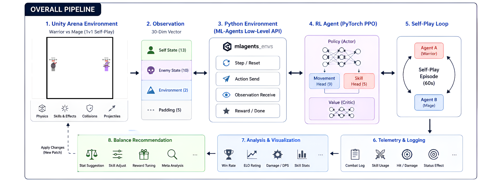
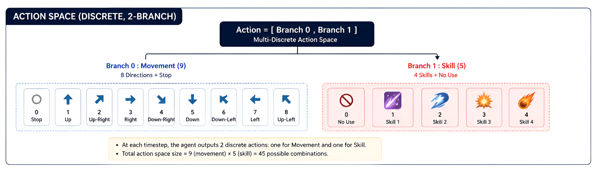
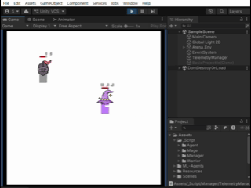

# ArenaRL-SelfPlay-PPO

**Self-Play Reinforcement Learning Arena built with Unity and PyTorch**

Warrior and Mage agents learn competitive PvP combat through a custom PPO implementation, self-play training, and telemetry-driven analysis.

---

# Project Overview

This project explores how reinforcement learning can be applied to competitive PvP combat in RPG games.

Unlike traditional scripted AI, two heterogeneous agents (Warrior and Mage) continuously improve by fighting against each other in a Unity arena using Self-Play.

The project is built from scratch using **PyTorch PPO**, **Unity ML-Agents Low-Level API**, and a custom telemetry pipeline for gameplay analysis.

---

# Architecture

<p align="center">

</p>

The training pipeline consists of:

- Unity 2D Arena Environment
- Self-Play PvP Simulation
- PyTorch PPO Training
- Telemetry Collection
- Gameplay Analysis
- Future Balance Recommendation System

---

# Action Space

<p align="center">

</p>

The agent outputs **two discrete actions every frame**.

### Branch 0 — Movement (9)

- Stop
- Up
- Down
- Left
- Right
- Up-Left
- Up-Right
- Down-Left
- Down-Right

### Branch 1 — Skill (5)

- Do Nothing
- Skill 1
- Skill 2
- Skill 3
- Skill 4

This Multi-Discrete action space enables simultaneous movement and skill execution.

---

# Demo

<p align="center">

</p>

The animation above shows the first self-play training environment between Warrior and Mage.

---

# Current Features

## Environment

- Warrior vs Mage Arena
- 1 vs 1 Self-Play
- 60-second Episodes

---

## Custom PPO

- PyTorch Implementation
- Actor-Critic Network
- Multi-Discrete Policy
- Entropy Bonus
- Replay Buffer

---

## Self-Play

- Symmetric Arena
- Continuous Policy Updates
- Custom Reward Functions

---

## Telemetry System

The project automatically records gameplay statistics during training.

Examples include:

- Win Rate
- Damage Dealt
- Damage Taken
- DPS
- Skill Usage
- Skill Hit Rate
- Survival Time
- Average Distance
- Charge Success
- CC Success

Telemetry data is later analyzed to guide reward tuning and game balancing.

---

# Experiment Log

Development is organized as a series of research experiments.

| No. | Experiment | Status |
|----:|------------|--------|
| 01 | [Initial Self-Play Training](Docs/experiments/01_initial_selfplay.md) | Complete |
| 02 | Asymmetric Reward Functions | In Progress |

Detailed reports are available in:

```
Docs/experiments/
```

---

# Roadmap

- Unity Arena Environment
- PyTorch PPO
- Self-Play
- Telemetry Logging
- Experiment Tracking

Next Goals

- Asymmetric Reward Functions
- ELO League Training
- Population-Based Self-Play
- Automatic Balance Recommendation
---

# Technologies
- Unity
- C#
- PyTorch
- Python
- PPO
- Reinforcement Learning
- Self-Play
- Telemetry Analysis

---
